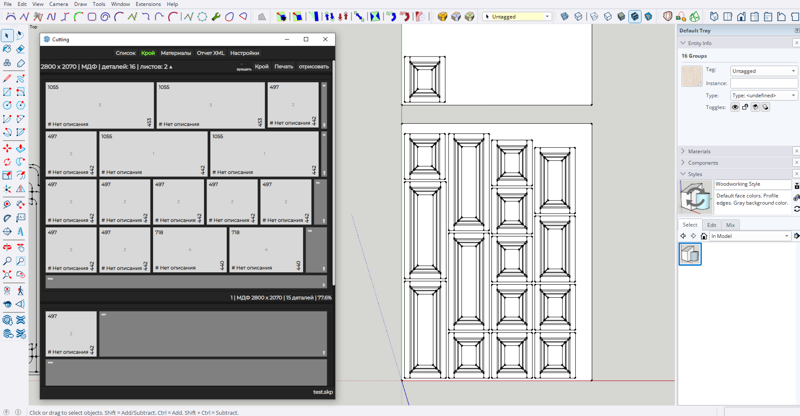

# cutting_helper Plugin for SketchUp

## Description
This plugin adds tools for creating specifications and cutting layouts for details in SketchUp.  
**The plugin is under development!!!** The author is not responsible for any errors or unexpected behavior.

## Screenshot

## Features
- **List**: This section allows you to add additional attributes to details, such as edge banding, rotation options, description, and material specification.
- **Cut**: This tab displays a list of materials in use. Clicking the **Cut** button generates a cutting layout.
- **Materials**: Here, you can edit the list of materials you are using.
- **XML Report**: Exports detail data to an XML file compatible with the [Cutting Optimization Pro](https://www.optimalprograms.com/cutting-optimization/) software.
- **Settings**: Allows you to configure the cutting tool, set offsets, define sheet trimming, material thickness, and edge banding adjustments.

## Installation
1. Download the plugin as a zip archive.
2. Extract the files to the SketchUp plugins folder.
3. Restart SketchUp.
4. The plugin will be available through the SketchUp menu.

## Usage
1. Select the details you plan to include in the cutting list and choose the **Cutting** option from the SketchUp plugins menu.
2. The detail list will be divided into layers, with each layer represented as a separate group. For instance, you can separate facades and case details into distinct groups. Assign materials to each group and proceed to the **Cut** tab.
3. In the materials list, each material will have a **Cut** button beneath it.
4. You can then generate a PDF report and render the cutting layout in the SketchUp workspace for further export, such as for CNC processing.

## Video
For a better understanding of the plugin's functionality, watch the tutorial on [YouTube](https://www.youtube.com/watch?v=RM_MeVCtCq8).

## Contacts
- **Authors**: Neproger, Vladimir Syroezhkin
- **Contact**: kazmazdev@gmail.com

## License
This project is licensed under the MIT License. See the LICENSE file for details.

# Плагин cutting_helper для SketchUp.

## Описание
Этот плагин добавляет инструменты для создания спецификаций деталей и их раскроя в SketchUp.
**Плагин находится на этапе разработки!!!** За возможные ошибки и не предвиденное поведение автор ответсвенности не несет!.

## Функции
- **Список**: В этом разделе можно добавить дополнительные атрибуты к деталям, такие как: кромка, возможность поворота детали, описание и указание материала.
- **Крой**: Вкладка отображает список используемых материалов. При нажатии на кнопку Крой генерируется карта раскроя.
- **Материалы**: Здесь можно редактировать список материалов, которые вы используете.
- **Отчет XML**: Экспортирует данные о деталях в файл XML, который можно использовать с программой [Cutting Optimisation Pro](https://www.optimalprograms.com/cutting-optimization/).
- **Настройки**: В разделе настроек можно указать используемый инструмент для резки. Также доступны параметры для смещения, обрезки листа, установки толщины материала и вычитания кромки. 

## Установка
1. Скачайте плагин zip архивом.
2. Разархивируйте файлы в каталог плагинов SketchUp.
3. Перезапустите SketchUp.
4. Плагин будет доступен через меню SketchUp.

## Использование
1. Выберите детали, которые планируете добавить в список кроя, и выберите пункт Cutting в меню плагинов SketchUp.
2. Список деталей будет разделен по слоям. Каждый слой будет представлен как отдельный список. Это позволит отделить фасады от корпусных деталей, например. Для каждой группы можно выбрать свой материал и перейти на вкладку **Крой**.
3. В списке материалов под каждым из них будет кнопка **Крой**.
4. Далее можно вывести отчет в формате PDF и отрисовать результат раскроя в пространстве SketchUp, чтобы экспортировать модель для ЧПУ-обработки, к примеру.

## Видео
Для лучшего понимания работы плагина посмотрите видеоурок [на YouTube](https://www.youtube.com/watch?v=RM_MeVCtCq8)

## Контакты
- **Авторы**: Neproger, Vladimir Syroezhkin
- **Контакты**: kazmazdev@gmail.com

## Лицензия
Этот проект распространяется под лицензией MIT. Подробнее см. в файле LICENSE.
